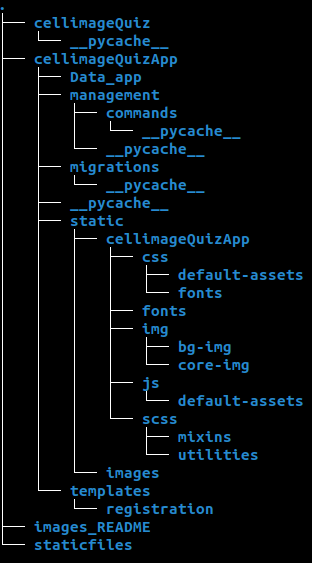

=============================================================================================
Cell Image Quiz 
=============================================================================================

### Welcome to Cell Image Quiz : Increase your knowledge in biology.

## Link to the web site:

https://abdeljalil.herokuapp.com/

## Installation

### Run in local:

Download all the files in the directory `Quiz_Cell_Images` :

- Create an conda environement :

`conda create --name django_env python=3.7`

- Activate conda environement

`conda activate django_env`

- Install packages

`conda install --name djangoenv django==3.0.3`

`conda install --name djangoenv sqlparse==0.4.1`

`conda install -c conda-forge django-tables2`

`conda install -c conda-forge dal`

`conda install -c conda-forge django-filter`

`conda install -c conda-forge django-bootstrap4`

- Or :

`conda install --file requirements.txt`

- Send to server:

`cd Quiz_Cell_Images `

- You will have a directory like this :

`python manage.py runserver`

### Home page

The home page should look like this once you run the server.

## Registration 

Click on the 'Sign Up' button to create an account.

## login

Click on 'login' button to log in.

You can select "START THE QUIZ:

## Microscopy Image

If you choose Quiz microscopy Image, you will see 3 images and you will have to say with what type of microscopy the images were observed.

here's an example:

you have 4 possibilities to answer:

if you select the correct answer you obtain 1 point:

If you give a wrong answer, you get minus one (-1)

## Compenent Cell types

If you pick Quiz 2 you will see  2 images and you will have to tell to which component they belong.

here's an example:

you have 4 possibilities to answer:

if you select the correct answer you obtain 3 points:

If you give a wrong answer, you get minus three (-3)

## Who is maintaining this repository ?

- Abdeljalil SENHAJI RACHIK [senhajirachikabdeljalil@gmail.com](senhajirachikabdeljalil@gmail.com)
