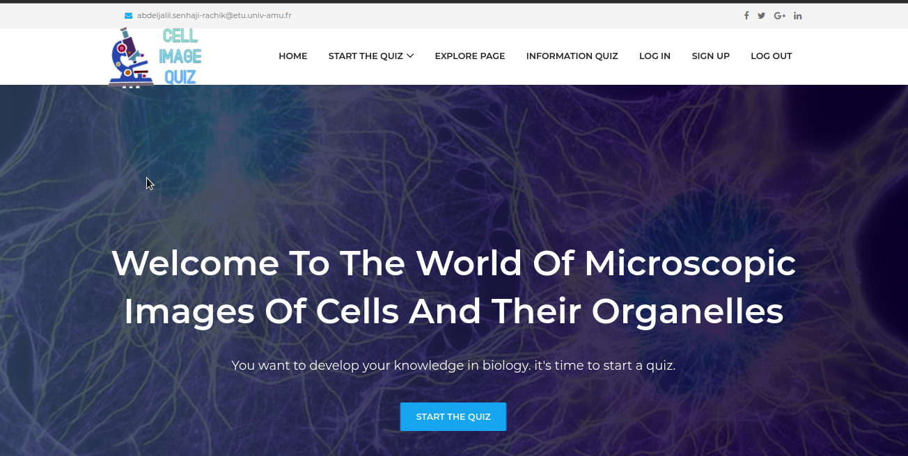
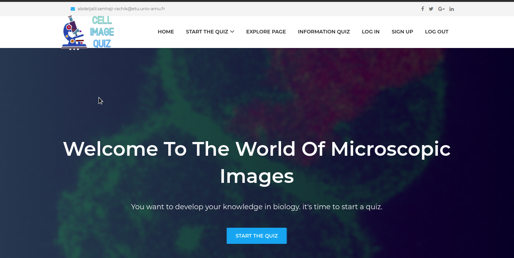
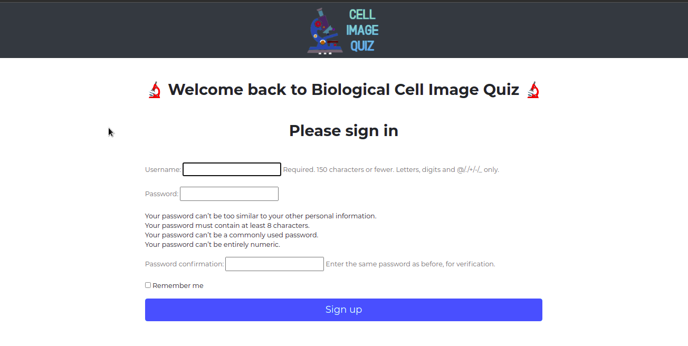
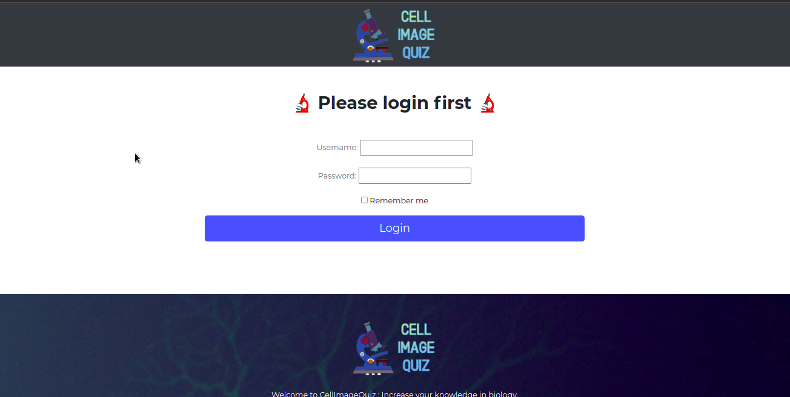
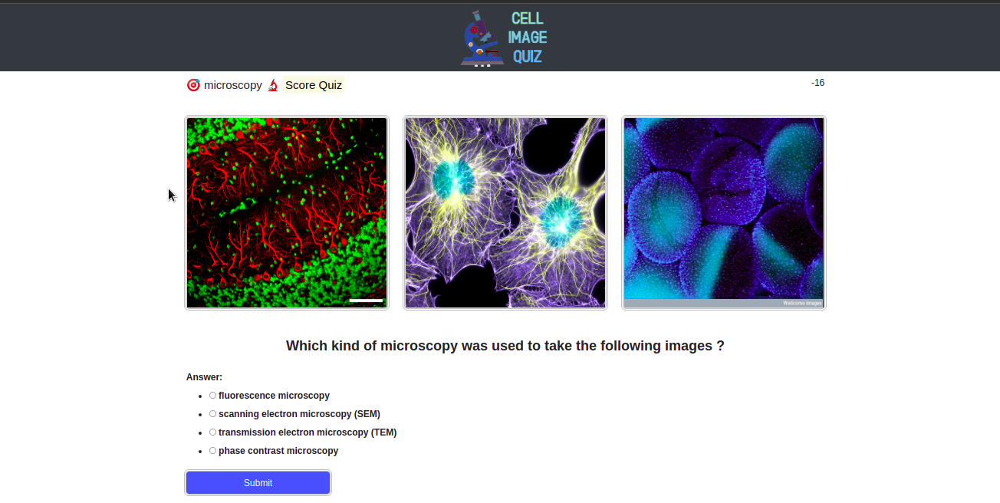
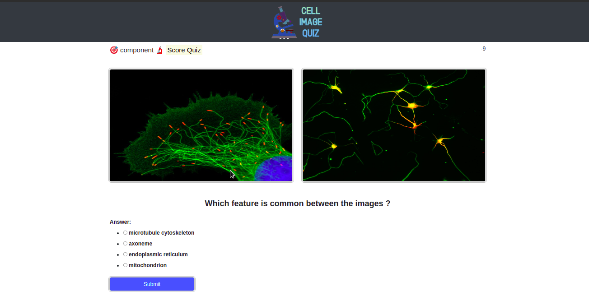
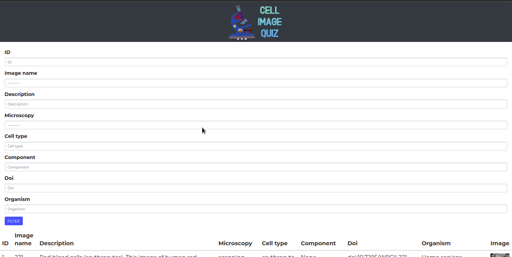

# **Tutorial**
CellImageQuizi s a playful learning website, you will learn how to recognise microscopy features and components by answering quiz.

## Link to the web site:
https://abdeljalil.herokuapp.com/

## Advantages of the application:

- The web pages where developed using bootstrap which gives an adaptative (responsive) form, for the web and for the mobile.
- jQuery is used to sort data, for the icon and for ajax.
- Different categories of quiz with different levels.
- Possibility to explore data (sort/filter)

## Installation

### Run in local:

Download all the files in the directory `projet_django ` , go to console:

- Create an environement:

`conda create --name envdjango python=3.7`

`Activate conda enviroment`

`conda activate envdjango`

- Install packages

`conda install --name djangoenv django==3.0.3`

`conda install --name djangoenv sqlparse==0.4.1`

file requeriement  :
asgiref==3.4.1
beautifulsoup4==4.10.0
certifi==2021.10.8
dj-database-url==0.5.0
Django==3.0.3
django-autocomplete-light==3.8.2
django-bootstrap3==15.0.0
django-bootstrap4==3.0.1
django-filter==21.1
django-heroku==0.3.1
django-tables2==2.4.1
gunicorn==20.0.4
importlib-metadata==2.1.1
psycopg2==2.8.2
python-decouple==3.4
pytz==2021.3
six==1.16.0
soupsieve==2.3
sqlparse==0.4.1
typing-extensions==3.10.0.2
whitenoise==5.3.0
zipp==3.6.0

- Send to server:

`cd projet_django`

`python manage.py runserver`

### Home page

The home page should look like this once you run the server.

## Registration 

Click on the 'Sign Up' button to create an account.

## login

Click on 'login' button to log in.
Once you log in, you will be redirected to the following page:

You can select "START THE QUIZ:

## Microscopy Image

If you pick Quiz 1 you will see 3 images and you will have to tell with
which kind of microscopy the images were obtained. 

Before getting in the quiz  choose a level you will be redirected to the Quiz:

here's an example:

you have 4 possibilities to answer:

if you select the correct answer you obtain 1 point:

if you give a bad answer, you do not obtain any point 

## Compenent Cell types

If you pick Quiz 2 you will see  2 images and you will have to tell to which component they belong.

here's an example:

you have 4 possibilities to answer:

if you select the correct answer you obtain 1 points:

if you give a bad answer, you do not obtain any point

## Explore:

You have the possiility to explore data, search and sort each column.

